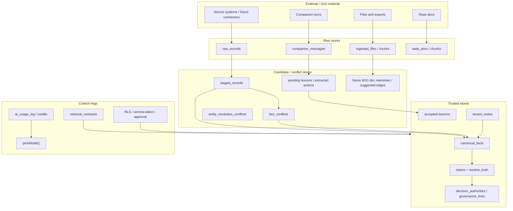

# Knowledge Contract Current-State Mapping

**Status:** Architecture truth-up  
**Date:** 2026-07-18  
**Related:** [Knowledge Contract](./knowledge-contract.md), [ADR-0013](./adr/0013-knowledge-contract.md)

## Purpose

This document maps existing Verdent/AWIP tables, docs, and features to the Knowledge Contract. It is deliberately a mapping, not a migration plan.

The most important design constraint: do not introduce a generic `knowledge_items` table yet. The existing stores have different truth, lifecycle, and authority rules. Unify them through contract semantics first.

## Lifecycle Mapping

| Contract state | Existing stores/features | Fit today | Notes |
|---|---|---|---|
| Raw information | `raw_records`, `ingested_files`, `companion_messages`, `awip_docs`, uploaded file storage, source-system exports | Strong for structured/file ingestion; partial for Companion | Companion messages are raw conversation, not durable memory. `awip_docs` are trusted internal docs by process, but stored as searchable raw/chunked material. |
| Candidate knowledge | `staged_records`, `fact_conflicts`, `entity_resolution_conflicts`, proposed `lessons`, `copilot_lessons` before acceptance, extracted `discussion_actions`, future W10 doc memories and suggested graph edges | Strong in ingestion; fragmented elsewhere | Candidate state is explicit for structured records, implicit for Companion and lessons. |
| Trusted knowledge | live `canonical_facts`, accepted `lessons`, active `tenant_nodes`, winning `claims`, `decision_authorities`, confirmed `governance_links`, approved future W10 documents/memories/edges | Strong foundations | Trust semantics differ by store and must remain domain-specific. |
| Superseded knowledge | `canonical_facts.superseded_by`, `source_mappings.superseded_by`, `tenant_nodes.superseded_by`, `claims.supersedes_id`, OKR supersession, planned W10 document revisions | Strong pattern | Supersession culture is already one of the repo's best architectural habits. |
| Retired knowledge | quarantined `staged_records`, dismissed/resolved `fact_conflicts`, rejected lessons, voided/expired claims, archived/superseded files, retention tombstones planned in W10 | Partial | Retirement reasons and retrieval behaviour are inconsistent across stores. |

## Table And Feature Mapping

| Area | Existing object | Contract role | Current strength | Gaps / caution |
|---|---|---|---|---|
| Structured ingestion | `source_mappings` | Domain adapter authority | Approved mappings are immutable except supersession. | Approval state is strong but mapping authority is adapter-specific, not yet a general refinery concept. |
| Structured ingestion | `raw_records` | Raw information | Has source kind, payload, hash, idempotency, PII declaration, retention. | Good foundation; source catalog/Oort boundary is not yet productised. |
| Structured ingestion | `staged_records` | Candidate knowledge | Captures validation status, errors, descriptors, proposed fact. | Candidate lifecycle is row/fact-shaped only. |
| Structured ingestion | `canonical_facts` | Trusted knowledge | Append-only except superseded pointer; live uniqueness; provenance to raw/staged/mapping. | No general trust dimensions beyond promotion path; not for prose/doc memory. |
| Structured ingestion | `fact_conflicts`, `conflict_rules` | Contradiction and resolution | Explicit conflict lifecycle and operator/rule resolution path. | Conflict rules are fact-shaped; future doc/graph conflicts need equivalent semantics. |
| Structured ingestion | `ingest_events` | Provenance | Append-only event trail. | Good; should be mirrored by future refinery streams. |
| File ingestion | `ingested_files` | Raw information plus emerging records lifecycle | W9 stores files, route, parser, status, events; W10 adds records class/retention/legal hold direction. | W10 approval lifecycle is not fully complete across all retrievals. |
| File ingestion | `ingested_file_chunks` | Searchable raw/candidate document material | Has chunks and embeddings. | Chunks are not knowledge by themselves; approval-aware retrieval must gate use. |
| Internal RAG | `awip_docs`, `awip_doc_chunks` | Internal documentation retrieval | Useful for Companion/Copilot grounding. | Not tenant/client knowledge; no automated CI re-ingest gap is documented. |
| W10 | Corporate knowledge ingestion plans | First full domain refinery proof | Defines lifecycle, approval boundary, doc memory, graph, CAD/BIM, FM bridge. | Proposed/partially landed; must become core programme rather than side module. |
| Companion | `companion_threads`, `companion_messages` | Raw conversation and interface ring | Threaded, RAG-aware, local/cloud model support, streaming resume. | Conversation remains primary object; no general candidate knowledge queue. |
| Companion | `PendingLessonsTray`, `copilot_lessons` | Candidate-to-memory seed | Human can edit/save proposed lessons. | Too narrow: only short lessons, source fixed as voice, no evidence/authority graph. |
| Companion | `discussion_actions` promotion/extraction | Candidate action extraction | Turns discussion into work. | Actions are work objects, not knowledge; avoid blending action promotion with knowledge promotion. |
| Memory | `lessons`, `lesson_events` | Durable learned rules | Candidate/accepted/rejected/superseded pattern exists. | Needs clearer distinction between global lessons, operator preferences, domain rules, and evidence-backed facts. |
| Notebook | `notebook_entries` | Reasoning/candidate evidence | Good human reasoning store. | Needs consistent links to objectives, entities, authority, and knowledge candidates. |
| Governance | `decision_authorities` | Authority rules | Git-versioned, precedence-based, evented. | Must remain separate from approval. |
| Governance | `claims`, `claim_events`, `truth_conflicts`, `resolve_truth()` | Assertions, arbitration, contradiction | Strong general truth pipeline. | Confidence currently compressed into source weight x claim confidence. |
| Governance | `governance_links`, `governance_chain()` | Relationships/evidence coverage | Makes gaps visible, manual by design. | Current relations are governance-specific, not full W10 knowledge graph edges. |
| Entities | `tenant_nodes`, aliases, resolver, entity conflicts/events | Entity spine | Hierarchical entity model with ancestry and conflict surfacing. | Domain-specific entity packs still need refinery-specific rules. |
| Retrieval | `retrieval_contracts` | Retrieval contract declaration | Correct shape-first discipline. | Coverage is intentionally incomplete; enforcement still emerging. |
| Routing | `_shared/model-policy.ts -> pickModel()` | Tactical model policy | Single chokepoint for night-cheap model selection. | Not a model/provider registry; does not yet represent capability, data boundary, locality, trust, or fallback policy. |
| Cost | `ai_usage_log`, `credit_entries`, balance snapshots/views | Cost control ring | AI calls and Lovable credit drift are visible. | Local model calls and non-Lovable external spend are not fully unified. |
| Sovereignty | `docs/sovereignty.md`, allowlists, RLS, service-token discipline | Data boundary/governance | Honest egress posture and strong RLS habits. | AI egress remains the biggest sovereignty gap. |

## Current Architecture Diagram

## Gaps Discovered

1. **The old architecture document is historically correct but no longer sufficient.** It frames Core as OKRs/capabilities/events only.
2. **W10 contains the first real refinery, but it is still documented as a corporate ingestion workstream rather than the central proof of the Knowledge Contract.**
3. **Companion has the right interface shape but the wrong durable object.** It captures turns and promotes actions/lessons; it does not produce general evidence-backed candidates.
4. **Memory is plural and fragmented.** Lessons, copilot lessons, notebook entries, docs, chunks, facts, claims, and events all remember different things with different rules.
5. **Confidence is underspecified.** Several tables have confidence-like fields, but dimensions are mixed.
6. **Approval-aware retrieval is not yet universal.** W10 states the target; current retrieval paths are mixed.
7. **Model routing is tactical.** `pickModel()` is a useful cost policy, not the future model constellation control plane.
8. **Cost visibility is strong for hosted Lovable AI calls and manual Lovable credit tracking, but not yet a fully unified multi-provider ledger.**
9. **The Oort Cloud boundary is not first-class.** Source adapters exist, but the product does not yet clearly distinguish external potential knowledge from governed internal knowledge.

## Explicit Non-Mapping

`discussion_actions` should not be treated as trusted knowledge just because they can come from Companion or findings. They are work/action objects. They may reference knowledge, produce knowledge, or require knowledge, but they should not become the knowledge core.

Similarly, `companion_messages` should not be treated as memory merely because they are stored. They are raw conversation. Durable memory starts only after extraction, evidence linkage, disposition, and promotion.
