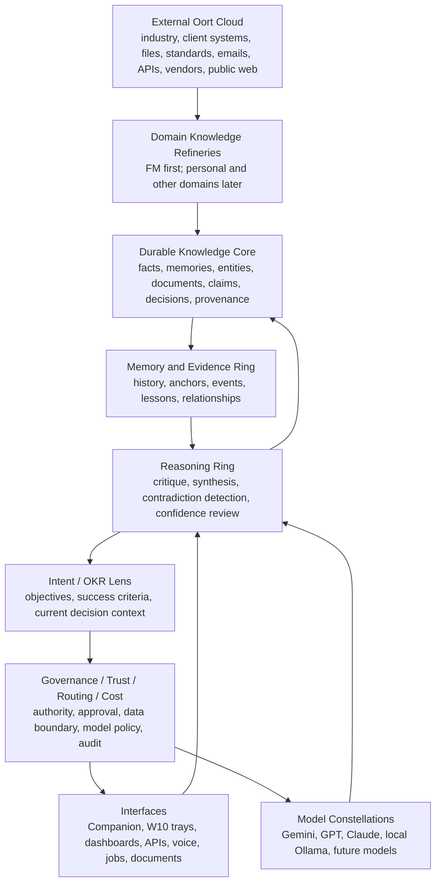
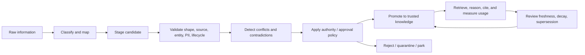

# Verdent / AWIP Knowledge Fabric Architecture

**Status:** Architecture truth-up  
**Date:** 2026-07-18  
**Branch:** `knowledge-refinery-architecture`  
**Related ADR:** [ADR-0013 Knowledge Contract](./adr/0013-knowledge-contract.md)  
**Binding contract:** [Knowledge Contract](./knowledge-contract.md)

## One Sentence

Verdent/AWIP is a knowledge-centred cognitive platform: external information is refined into governed, durable knowledge; intent and OKRs focus that knowledge; AI models remain replaceable reasoning engines around it.

The models are transient. The knowledge persists.

## Why This Truth-Up Exists

The original AWIP Core architecture correctly described Core as a substrate for OKRs, capabilities, and events. The repository has since grown beyond that first substrate. It now contains ingestion, canonical facts, conflicts, provenance, entity resolution, retrieval contracts, governance links, lessons, Companion conversations, AI usage, and W10 corporate knowledge ingestion plans.

This document does not redesign the UI and does not introduce new schema. It names the architecture that the repo is already moving toward so future work has a stable centre of gravity.

## Architectural Principle

Knowledge is the durable asset. Tasks, agents, councils, prompts, models, and interfaces are runtime mechanisms around that asset.

AWIP should therefore optimise for:

- refining raw information into trusted knowledge;
- preserving provenance, authority, confidence, and contradiction state;
- applying knowledge against explicit intent and OKRs;
- using models as interchangeable reasoning resources;
- measuring cost, trust, and auditability for every model-assisted step.

## Concentric Model

The diagram is conceptual, not a proposed physical schema. The Knowledge Contract defines which existing stores own each lifecycle state.

## The Oort Cloud

The Oort Cloud is everything outside the governed knowledge core:

- client files, exports, CAD/BIM, COBie, CAFM/IWMS/CMMS data;
- regulations, standards, supplier documents, open-source projects, research;
- emails, chats, meeting notes, voice transcripts, GitHub, documents;
- model outputs from GPT, Claude, Gemini, Grok, local models, and future providers.

Oort material is not trusted knowledge. It is potential knowledge. It must pass through a domain refinery before agents or operators treat it as durable truth.

## Domain Knowledge Refineries

A refinery is the controlled pathway from external information to durable knowledge. The pipeline is generic, but each domain supplies its own rules.

The FM refinery is the first domain implementation. W10 corporate knowledge ingestion is the first full proof because it adds records lifecycle, approval boundary, document memory, knowledge graph, CAD/BIM extraction, and FM tool reconciliation.

Future domain refineries may include personal knowledge, healthcare, legal, finance, or manufacturing, but they must reuse the same contract: raw -> candidate -> trusted -> superseded/retired, with provenance and authority preserved.

## Knowledge Core

The Knowledge Core is not one table. It is a governed set of stores with compatible lifecycle semantics:

- `canonical_facts` for structured, append-only facts;
- `tenant_nodes` and entity resolution state for the client estate graph;
- `claims`, `decision_authorities`, and `truth_conflicts` for arbitration;
- `ingested_files`, `ingested_file_chunks`, and future W10 document lifecycle/memory stores for document knowledge;
- `awip_docs` and `awip_doc_chunks` for internal project documentation RAG;
- `lessons`, `copilot_lessons`, and future candidate queues for learned rules and operator preferences;
- `notebook_entries`, `governance_links`, and event streams for reasoning, evidence, and traceability.

The platform may later add read models or views that present these as a unified fabric. It must not collapse them into a premature generic `knowledge_items` table.

## Intent And OKRs

Intent is the current lens through which the knowledge core is used. OKRs are the structured, durable expression of intent.

This keeps work outcome-centred:

- a task exists because it moves an objective;
- a document exists because it supports a decision;
- a model run exists because it refines, challenges, retrieves, or applies knowledge;
- a cost matters because it contributed to an objective.

Intent should filter context. It should not own the long-lived knowledge itself.

## Governance, Trust, Routing, And Cost

Governance remains a control ring, not decoration:

- authority is declared through ontology and `decision_authorities`;
- contradiction is surfaced through fact conflicts, truth conflicts, and entity-resolution conflicts;
- approval gates determine when candidate knowledge can be retrieved by agents;
- RLS, service-token discipline, and security-definer write paths preserve tenant boundaries;
- model calls use declared policy and are logged to `ai_usage_log`;
- credit and AI usage views make cost visible.

Core must remain the system of record. Runtime routing and "who acts when" logic belongs in the Control Plane, modules, or model/provider runtime, consistent with the existing Core rule.

## Interfaces

Interfaces are the outer operational surfaces:

- Companion for human discussion and candidate extraction;
- W10 approval/memory/graph trays for corporate knowledge refinement;
- Morning Review, Jobs, Governance, Notebook, and AI Usage for operational oversight;
- APIs and connectors for external systems.

Interfaces should increasingly expose the refinery loop: proposed knowledge, evidence, contradiction, approval, and objective links. They should not make chat, agents, or routing feel like the product centre.

## Model Constellations

Models are replaceable constellations outside the knowledge core. They may reason, extract, classify, challenge, summarise, or propose, but they do not own durable truth.

Required properties for model use:

- every hosted model call has usage and cost logging;
- local model calls should be represented in the same audit story even when cost is zero;
- model choice should be governed by capability, cost, locality, data boundary, trust, and fallback policy;
- cross-model review is useful as a runtime pattern, not a first-class reason to reshape the knowledge core.

## Assumptions

- AWIP Core remains the foundation rather than starting a new repo.
- The July 18 architecture review is treated as valid background evidence, then checked against repository docs, migrations, and code.
- W10 is the first full FM refinery proof, not a side module.
- Companion is the first human-facing refinery intake surface, but its current lesson/action extraction is only a seed.
- Future OmniFlow ideas may be imported as runtime infrastructure after the knowledge/refinery contract is stable.

## Known Gaps

- The live product hierarchy still surfaces an operator/admin console more strongly than a knowledge-centred platform.
- Existing memory stores overlap: lessons, copilot lessons, notebook entries, documents, chunks, facts, claims, messages, and events.
- Confidence is present in places but not separated into source reliability, extraction certainty, truth confidence, freshness, and retrieval trust.
- Companion writes lessons/actions, not general candidate knowledge with evidence and authority state.
- Local model usage is not consistently represented as a first-class cost/audit trail.
- W10 approval-aware retrieval is planned and partially scaffolded, but not complete across every retrieval path.

## Non-Goals For This Truth-Up

- No UI redesign.
- No migrations.
- No production code changes.
- No new generic `knowledge_items` table.
- No new agent/council/routing features.
- No attempt to make AWIP domain-neutral before the FM refinery proof works.
