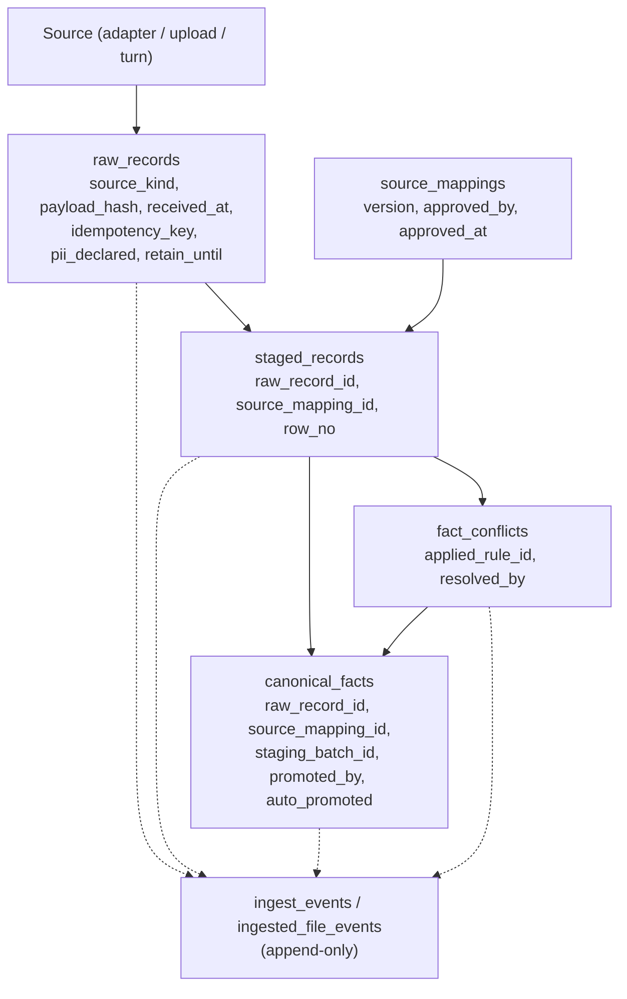
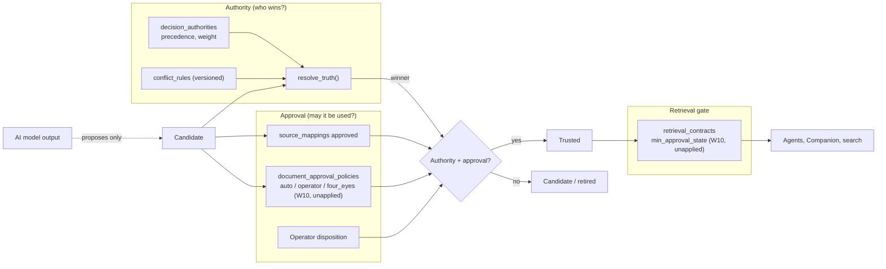

# Knowledge Refinery — Architecture Diagrams

Companion to the Knowledge Contract (ADR-0013). Grounded in the live schema as of 2026-10-06.
Items marked *(W10, unapplied)* exist in migrations `20260717150000` / `20260717160000` but are not yet in the database.

## 1. Lifecycle: raw → candidate → trusted

```mermaid
flowchart LR
  subgraph RAW["Raw information"]
    rr["raw_records"]
    inf["ingested_files<br/>lifecycle=ingested (W10, unapplied)"]
    cm["companion_messages"]
  end

  subgraph CAND["Candidate knowledge"]
    sr["staged_records<br/>validation_status"]
    fc["fact_conflicts<br/>status=open"]
    pr["ingested_files<br/>pending_review (W10, unapplied)"]
    lp["lessons<br/>status=proposed"]
    cl["claims<br/>unresolved"]
  end

  subgraph TRUST["Trusted knowledge"]
    cf["canonical_facts (live)"]
    ap["ingested_files<br/>approved / auto_approved (W10, unapplied)"]
    la["lessons<br/>status=applied"]
    cw["claims<br/>resolve_truth() winner"]
  end

  subgraph SUP["Superseded"]
    cfs["canonical_facts.superseded_by"]
    cls["claims.supersedes_id"]
    fs["ingested_files superseded"]
  end

  subgraph RET["Retired"]
    q["staged_records quarantined"]
    lr["lessons rejected"]
    cv["claims voided_at"]
    fr["files archived / quarantined / rejected"]
  end

  rr --> sr
  sr -->|valid, no clash| cf
  sr -->|clash with live value| fc
  sr -->|invalid| q
  fc -->|resolved| cf
  inf --> pr
  pr -->|approved| ap
  pr -->|rejected| fr
  cm -.->|extraction (proposal-only)| lp
  lp --> la
  lp --> lr
  cl --> cw
  cl --> cv
  cf --> cfs
  cw --> cls
  ap --> fs
```

## 2. Provenance chain

Every trusted item must answer: where from, who transformed it, what checks, what conflicts, what authority, what replaced it.



## 3. Authority vs approval

Authority answers **who wins**. Approval answers **may this be used**. Both are required for trusted knowledge; neither is the AI model.



## Known contradictions (see verification, 2026-10-06)

1. `ingested_files.status='superseded'` overlaps the W10 `lifecycle='superseded'`.
2. `copilot_lessons` has only `active`; no candidate state or source-turn pointer.
3. `lessons` has no superseded state.
4. File retirement reason/actor lives only in events.
