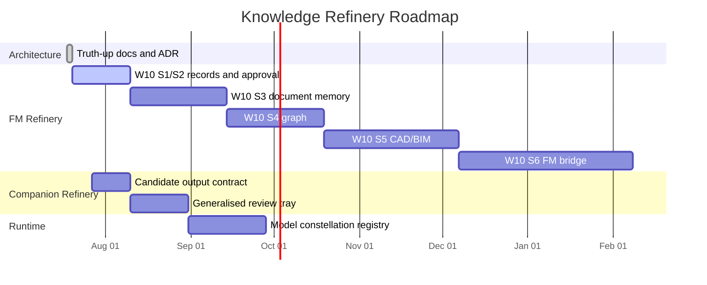
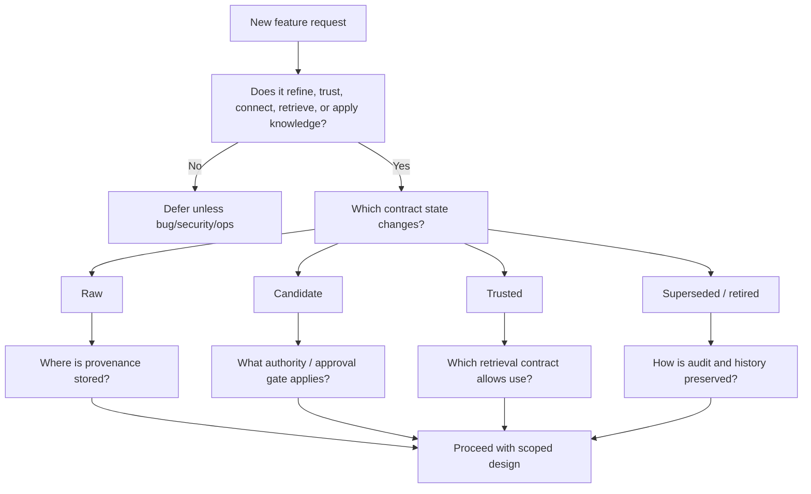

# Knowledge Refinery Implementation Plan

**Status:** Architecture plan, no code changes  
**Date:** 2026-07-18  
**Related:** [Knowledge Fabric Architecture](./knowledge-fabric-architecture.md), [Knowledge Contract](./knowledge-contract.md), [ADR-0013](./adr/0013-knowledge-contract.md), [Current-State Mapping](./knowledge-contract-current-state.md)

## Guiding Constraint

Do not build another AI feature until the Knowledge Contract is stable enough to govern W10 and Companion.

This plan is documentation-only on the `knowledge-refinery-architecture` branch. It deliberately avoids migrations, UI changes, and speculative runtime work.

## Phase 0 - Architecture Truth-Up

**Goal:** Align the repo's architecture language with what the codebase has become.

Deliverables:

- accepted Knowledge Contract ADR;
- concise knowledge-centred architecture vision;
- current-state mapping from existing stores to the contract;
- phased refinery plan;
- README and architecture-doc pointers;
- draft PR for review.

Exit criteria:

- no production code changes;
- no database migrations;
- no UI changes;
- branch documents assumptions and gaps.

## Phase 1 - Make W10 The First Refinery Proof

**Goal:** Treat W10 corporate knowledge ingestion as the first full FM refinery implementation, not as one ingestion feature among many.

Scope:

- records identity;
- lifecycle and approval trust boundary;
- document memory with anchored evidence;
- graph relationships;
- CAD/BIM structured extraction;
- FM tool reconciliation.

Contract focus:

```text
source file/export
  -> raw information
  -> candidate records/memories/facts/edges
  -> validation + approval + conflict checks
  -> trusted document memory / graph edge / canonical fact
  -> retrieval under approval-aware contracts
```

Do first:

- make W10 S1/S2 approval boundary the keystone;
- ensure every W10 stage declares raw/candidate/trusted/superseded/retired ownership;
- make approval-aware retrieval the default for agent-facing paths;
- keep high-consequence memories proposal-only until operator approval and evaluation gates pass.

Do not do yet:

- generalise to personal Verdent;
- build additional model-provider orchestration;
- expose a public graph API;
- create generic knowledge tables.

## Phase 2 - Turn Companion Into A Refinery Front Door

**Goal:** Keep Companion as the human-facing discussion surface, but make its durable output candidate knowledge rather than loose chat memory.

Current seed:

- `companion_threads` and `companion_messages` store raw turns;
- RAG and live environment context are injected per turn;
- `PendingLessonsTray` lets the operator accept short lessons;
- actions can be promoted to `discussion_actions`;
- cloud calls use `companion-cloud-chat` and `ai_usage_log`.

Target loop:

```text
conversation turn
  -> extracted candidates
  -> classified as lesson, claim, decision, open question, contradiction, action, objective link
  -> evidence pointer to exact source turn(s)
  -> operator approve / edit / reject / park
  -> trusted store or retired candidate
```

Implementation notes for the later build phase:

- expand the pending tray concept before adding more chat features;
- keep actions separate from knowledge candidates;
- attach candidates to objectives, entities, documents, decisions, or tenants where possible;
- treat auto-extraction as proposal-only;
- log hosted and local model use consistently.

## Phase 3 - Define Refinery Contracts Per Domain

**Goal:** Convert the Knowledge Contract into domain pack declarations once W10 proves the FM path.

Each refinery pack should declare:

- source adapters;
- raw stores;
- candidate stores;
- trusted stores;
- authority rules;
- approval gates;
- conflict rules;
- confidence dimensions;
- retrieval contracts;
- retention/supersession rules;
- ownership model.

First pack:

- FM / corporate knowledge refinery.

Second pack, only after FM proof:

- personal Verdent refinery for ChatGPT, Claude, Perplexity, Grok, GitHub, Obsidian, documents, and voice notes.

## Phase 4 - Rationalise Memory Stores

**Goal:** Reduce conceptual fragmentation without flattening domain integrity.

Work:

- map `lessons`, `copilot_lessons`, `notebook_entries`, `claims`, document memories, and governance links to distinct lifecycle roles;
- decide where "candidate" lives for each store;
- add views/read models only after ownership and lifecycle are stable;
- keep source-specific tables where lifecycle differs.

Anti-pattern to avoid:

```text
one table called knowledge_items with type = fact|lesson|memory|claim|doc|message
```

That would hide the hard parts rather than solve them.

## Phase 5 - Generalise Model Constellations

**Goal:** Add richer routing only after the knowledge/refinery contract is stable.

Future runtime capabilities may include:

- provider registry;
- model registry;
- local vs hosted data-boundary policy;
- model capability tags;
- trust/locality/cost attributes;
- fallback behaviour;
- per-run audit and cost;
- cross-model review as a runtime strategy.

Placement:

- not inside the Knowledge Core;
- not as the product centre;
- not as "who acts when" logic inside Core;
- controlled by runtime/control-plane infrastructure.

OmniFlow ideas can be imported here if they still fit.

## Phase 6 - Knowledge-Centred Product Surface

**Goal:** Redesign navigation and product hierarchy only after the contract and first refinery proof are working.

Candidate front-door concepts:

- current objectives;
- what changed;
- what needs validation;
- unresolved conflicts;
- evidence supporting/challenging an intent;
- knowledge promoted this week;
- cost and model use by objective.

Do not start here. UI hierarchy should follow the contract, not compensate for an unclear contract.

## Feature Freeze Boundaries

Until Phase 1 and Phase 2 contracts are understood, freeze or de-emphasise:

- new standalone agent/council features;
- new voice/video/Telegram surfaces unless directly tied to a refinery workflow;
- new model routing abstractions beyond necessary `pickModel()` maintenance;
- UI reorganisation that promotes "Knowledge" without lifecycle clarity;
- broad personal-knowledge ingestion;
- new autonomous loops without a typed contract and retrieval declaration.

Allowed during the freeze:

- documentation and ADR work;
- W10 trust-boundary implementation already planned;
- Companion changes that turn turns into governed candidates;
- bug fixes, security fixes, RLS hardening, observability, and cost logging;
- tests and docs that enforce existing invariants.

## Non-Goals

- Do not start a new platform repo.
- Do not merge OmniFlow wholesale into AWIP.
- Do not convert AWIP into a generic AI OS.
- Do not make chat history the memory layer.
- Do not claim domain independence until FM and one second domain share the contract.
- Do not move "who acts when" routing into Core.
- Do not build speculative refineries for industries without real source material and authority rules.

## Implementation Roadmap Diagram



Dates beyond the current branch are planning placeholders, not commitments.

## Decision Tree For New Work



## Assumptions And Gaps

Assumptions:

- AWIP Core remains the foundation.
- W10 is approved as the first refinery proof.
- Companion remains the first human-facing intake surface.
- Core rule 4 remains binding: Control Plane/modules/runtime own dispatch and model routing decisions.

Gaps:

- No live code check was run for behaviour; this branch is documentation-only.
- No signed-in app validation was repeated in this session; the mapping uses the supplied architecture review plus local repo inspection.
- The exact future schema for W10 document memory and graph remains deferred to W10 implementation ADRs.
- The model/provider registry should not be designed until knowledge lifecycle and retrieval approval are stable.
